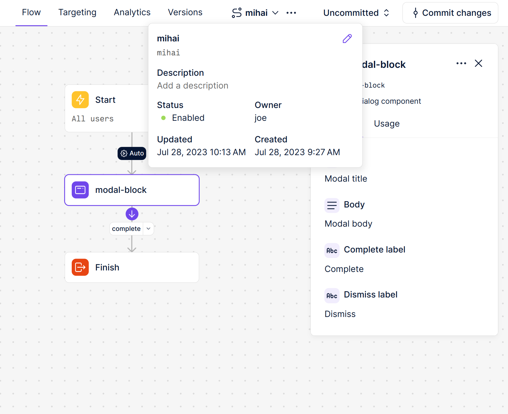
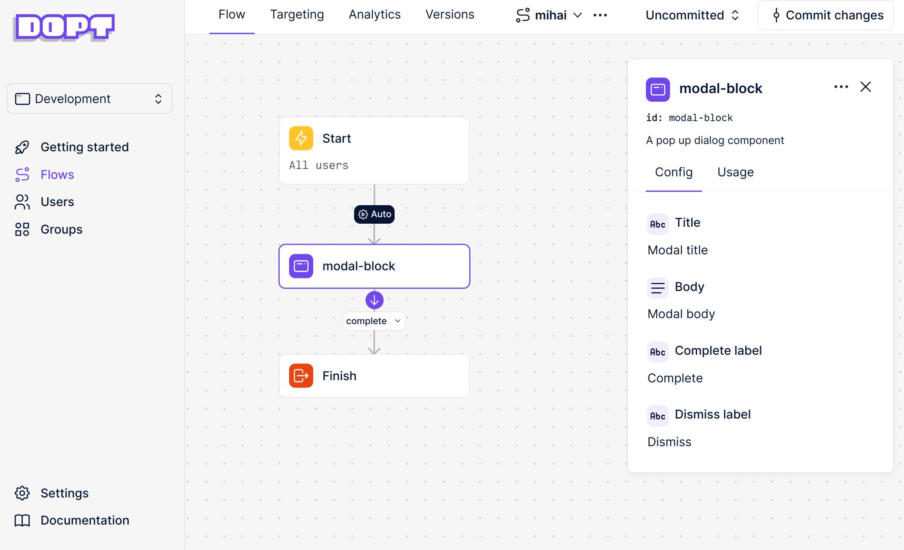

# @dopt/javascript w/ Vue

## Overview

This repo assumes the following.

You've created a flow named `mihai`.


The flow has a single modal block named `modal-block`


## Setup

```
git clone git@github.com:joemckenney/vue-example-for-mihai.git;
cd vue-example-for-mihai;
pnpm i;
```

Replace the API keys used in the clients created in [App.vue](./src/App.vue) with your API keys.

Then `pnpm run dev`.
